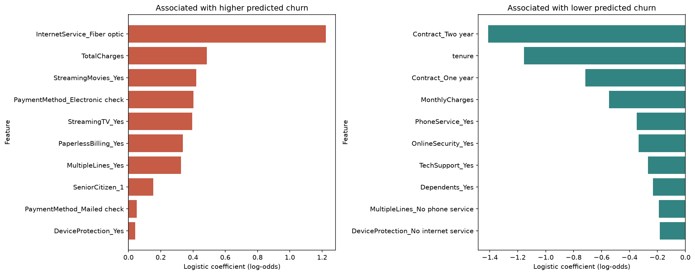
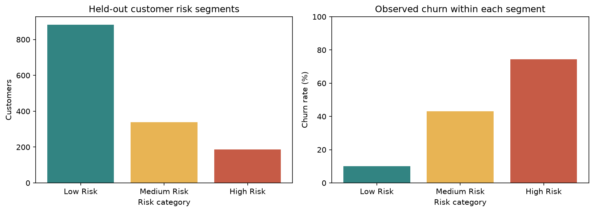

# Customer Churn Analytics and Prediction

## 1. Project Overview

An end-to-end, basic-to-intermediate Python portfolio project that connects customer
churn analysis, predictive modeling, interpretation and a Streamlit dashboard.
The existing six-notebook workflow is retained. All final metrics below are from
executed notebook 06; earlier model comparisons are recorded outputs in notebook 05.

## 2. Business Problem

Identify customer characteristics associated with churn and demonstrate how a retention
team could prioritize limited outreach capacity. Missing a churner and contacting a
customer who would stay have different costs, so the model choice depends on the objective.

## 3. Dataset

The sample IBM Telco Customer Churn dataset contains **7,043 customers**,
21 original columns and an overall churn rate of **26.54%**.
The original target is `Churn` (Yes/No); `ChurnFlag` is its binary equivalent.
The sample is historical and observational and should not be assumed representative of
a current telecom business. Source CSV: `data/raw/WA_Fn-UseC_-Telco-Customer-Churn.csv`.

## 4. Project Objectives

- Understand data quality and descriptive churn patterns.
- Compare reproducible models with preprocessing fitted on training data.
- Explain predictive associations without causal claims.
- Produce held-out customer risk segments and a demonstration retention queue.
- Support interactive predictions using original customer features.

## 5. Tech Stack

Python 3.13 (validated environment), pandas, NumPy, Matplotlib, seaborn, scikit-learn,
Jupyter, joblib and Streamlit. `requirements.txt` contains only direct project dependencies,
pinned to the validated environment. XGBoost, imbalanced-learn and SHAP are not used.

## 6. Project Structure

```text
customer-churn-analytics/
├── data/
│   ├── raw/WA_Fn-UseC_-Telco-Customer-Churn.csv
│   └── processed/
│       ├── telco_churn_cleaned.csv
│       ├── telco_churn_engineered.csv
│       ├── customer_risk_segments.csv
│       ├── high_risk_customers.csv
│       ├── risk_summary.csv
│       ├── model_evaluation.csv
│       ├── gradient_boosting_importance.csv
│       ├── interpretable_logistic_coefficients.csv
│       ├── key_churn_drivers.csv
│       └── eda_churn_rates.csv
├── notebooks/
│   ├── 01_data_understanding.ipynb
│   ├── 02_data_cleaning.ipynb
│   ├── 03_eda.ipynb
│   ├── 04_feature_engineering.ipynb
│   ├── 05_modeling.ipynb
│   └── 06_model_evaluation_and_interpretation.ipynb
├── models/
│   ├── tuned_gradient_boosting.joblib
│   ├── balanced_logistic_regression.joblib
│   ├── interpretable_logistic_regression.joblib
│   └── metadata.json
├── src/churn.py
├── app/app.py
├── images/
├── requirements.txt
└── README.md
```

Joblib artifacts are generated locally and ignored by Git. Run notebooks 05 and 06 to
recreate them on a fresh checkout. Metadata and CSV outputs record the evaluated run.

## 7. Data Understanding

Each row represents a customer, including demographics, account tenure, subscribed
services, contract and billing details. Inspection verifies unique customer IDs, no
duplicate rows, and 11 blank `TotalCharges` values, all for customers with zero tenure.

## 8. Data Cleaning

Convert `TotalCharges` to numeric and replace those verified zero-tenure blanks with
zero. Trim categorical whitespace, retain meaningful `No internet service` and
`No phone service` categories, validate nonnegative numeric values and derive
`ChurnFlag`. Raw data is never overwritten; cleaned and engineered CSVs are separate.

## 9. Exploratory Data Analysis

The following values are calculated from the full sample, not the held-out subset:

| Feature | Category | Customers | Churn rate |
| --- | --- | --- | --- |
| Contract | Month-to-month | 3875 | 42.71% |
| Contract | One year | 1473 | 11.27% |
| Contract | Two year | 1695 | 2.83% |
| InternetService | DSL | 2421 | 18.96% |
| InternetService | Fiber optic | 3096 | 41.89% |
| InternetService | No | 1526 | 7.40% |
| PaymentMethod | Bank transfer (automatic) | 1544 | 16.71% |
| PaymentMethod | Credit card (automatic) | 1522 | 15.24% |
| PaymentMethod | Electronic check | 2365 | 45.29% |
| PaymentMethod | Mailed check | 1612 | 19.11% |
| OnlineSecurity | No | 3498 | 41.77% |
| OnlineSecurity | No internet service | 1526 | 7.40% |
| OnlineSecurity | Yes | 2019 | 14.61% |
| TechSupport | No | 3473 | 41.64% |
| TechSupport | No internet service | 1526 | 7.40% |
| TechSupport | Yes | 2044 | 15.17% |

Churned customers have mean tenure **17.98 months**, versus **37.57** for retained
customers. Mean monthly charges are **74.44**, versus **61.27**. These are descriptive
associations, with no adjustment for other customer characteristics.

## 10. Feature Engineering

`TenureGroup` uses 0–12, 13–24, 25–48, 49–60 and 61+ month bands. `TotalServices`
counts the eight explicit Yes service flags **plus active internet service**. Both
are retained for prediction; neither uses the target. `src/churn.py` reproduces
notebook 04 exactly and is used within the exported prediction pipelines.

## 11. Machine Learning Pipeline

A stratified 80/20 split with `random_state=42` gives **5,634 training**
and **1,409 test** customers. `customerID`, `Churn` and `ChurnFlag`
are excluded from model inputs. Numerical features use median imputation and standard
scaling; categorical features use most-frequent imputation and one-hot encoding with
unknown categories ignored. Estimator pipelines keep learned preprocessing inside
training and cross-validation folds. Deterministic feature engineering requires no fit
to population statistics. Saved pipelines include feature derivation, preprocessing and classifier.

## 12. Models Compared

Notebook 05 records the original baseline comparison below; these completed experiments
were preserved and were not rerun during the final evaluation work.

| Model | Accuracy | Precision | Recall | F1 | ROC-AUC |
| --- | --- | --- | --- | --- | --- |
| Logistic Regression | 0.7991 | 0.6522 | 0.5214 | 0.5795 | 0.8425 |
| Decision Tree | 0.7289 | 0.4900 | 0.5214 | 0.5052 | 0.6624 |
| Random Forest | 0.7779 | 0.6041 | 0.4733 | 0.5307 | 0.8210 |
| Gradient Boosting | 0.8055 | 0.6748 | 0.5160 | 0.5848 | 0.8428 |

## 13. Class Imbalance Handling

The target is moderately imbalanced. `class_weight="balanced"` increased Logistic
Regression churn recall from **0.5214** to **0.7914**, with precision falling from
**0.6522** to **0.4983**. Balanced tree and forest experiments are retained in notebook
05. SMOTE was not used; class weighting kept the workflow straightforward.

## 14. Hyperparameter Tuning

Notebook 05 used shuffled five-fold `StratifiedKFold(random_state=42)` on training data,
ROC-AUC scoring, a Logistic Regression grid and 20 randomized Gradient Boosting
configurations. Best balanced Logistic Regression `C=1`. Recorded best Gradient
Boosting CV ROC-AUC: **0.850739**. Selected settings:

```python
{
    "subsample": 0.8,
    "n_estimators": 200,
    "min_samples_split": 2,
    "min_samples_leaf": 4,
    "max_depth": 3,
    "learning_rate": 0.03,
    "random_state": 42,
}
```

## 15. Model Evaluation

Re-executed notebook 06 evaluates the saved candidates on the same held-out customers.
Classification metrics use 0.50; ROC-AUC uses continuous scores.

| Model | Accuracy | Precision | Recall | F1 | ROC-AUC |
| --- | --- | --- | --- | --- | --- |
| Tuned Gradient Boosting | 0.8041 | 0.6701 | 0.5160 | 0.5831 | 0.8472 |
| Balanced Logistic Regression | 0.7331 | 0.4983 | 0.7914 | 0.6116 | 0.8422 |
| Interpretable Logistic Regression | 0.7381 | 0.5043 | 0.7834 | 0.6136 | 0.8417 |

**Model strategy:** tuned Gradient Boosting for general risk ranking, with higher
ROC-AUC, precision and accuracy than balanced Logistic Regression in this evaluation.
Balanced Logistic Regression is useful when recall matters most, at the cost of more
false positives; it also has higher F1 here. The simplified model is for interpretation.
The AUC difference is modest and has no uncertainty interval. A lower Gradient Boosting
threshold is another option to validate for recall-focused campaigns.

The threshold plots are descriptive test-set comparisons, not a validated threshold
optimization. The deployment class threshold stays at 0.50. Choose a business threshold
with training-only cross-validation or separate validation data, then evaluate once on
fresh held-out data. Existing candidate comparison reused this test set, limiting claims
that it is a completely untouched final selection holdout.

## 16. Model Interpretation

Gradient Boosting importance measures predictive usefulness without direction.
The interpretation-only balanced Logistic Regression removes `TenureGroup` and
`TotalServices`, retains original inputs, uses scaled numerical features, and uses
`OneHotEncoder(handle_unknown="ignore", drop="first")`. It has `max_iter=1000` and
`random_state=42` and is fitted only on the training subset.

Positive coefficients are associated with higher predicted churn; negative coefficients
with lower predicted churn. Numeric coefficients are per standard-deviation increase;
categorical coefficients are relative to the reference categories shown in notebook 06.
They are log-odds coefficients, not changes in probability or causal effects.

Examples: fiber optic versus DSL **+1.2224**; electronic check versus automatic bank
transfer **+0.4025**; two-year versus month-to-month contract **−1.4125**; tenure
**−1.1562**. The monthly-charge coefficient is **−0.5462**, despite higher unadjusted
charges among churners. Charges, tenure and service bundles remain correlated; avoid
claiming all methods agree about the direction of monthly charges.



## 17. Key Churn Drivers

EDA, Gradient Boosting importance and simplified coefficients support associations
involving contracts, tenure, fiber optic internet, security/support and payment method.
Month-to-month, short-tenure, fiber optic and electronic-check patterns are associated
with higher churn. Longer contracts and security/support subscriptions show lower-risk
patterns. Monthly charges merit investigation based on EDA and predictive importance,
but their adjusted direction differs. `key_churn_drivers.csv` aligns the actual evidence
and coefficient references. Feature importance alone does not identify higher-risk categories.

## 18. Customer Risk Segmentation

Use the tuned Gradient Boosting scores for the **held-out test customers only**:

- **Low Risk:** probability < 0.30.
- **Medium Risk:** 0.30 ≤ probability < 0.60.
- **High Risk:** probability ≥ 0.60.

| Risk category | Customers | Share | Observed churn |
| --- | --- | --- | --- |
| Low Risk | 883 | 62.67% | 10.08% |
| Medium Risk | 339 | 24.06% | 43.07% |
| High Risk | 187 | 13.27% | 74.33% |

These are demonstration thresholds. Real thresholds depend on retention budget,
false-positive and false-negative costs, and customer lifetime value. Scores have not
been calibrated for business use. A 0.55 score is classified as churn at 0.50 but remains
Medium Risk under the separate segment bands.

`customer_risk_segments.csv` contains customerID, ActualChurn, ChurnProbability and
RiskCategory. Labels are joined after prediction. `high_risk_customers.csv` contains
the descending high-risk queue plus original account information and excludes actual
churn. These are historical customers, not an operational outreach list.



## 19. Business Recommendations

- Test optional longer-contract incentives for month-to-month customers.
- Test onboarding check-ins for new customers.
- Investigate fiber optic experience, pricing and perceived value.
- Review plan fit for high-charge customers; the adjusted charge association is uncertain.
- Test appropriate Online Security and Tech Support offers.
- Investigate electronic-check payment friction and offer convenient alternatives.
- Prioritize a limited high-risk retention pilot and measure incremental retention and cost
  against a randomized control group.

These actions are supported as hypotheses worth testing, not proven churn-reduction interventions.

## 20. Streamlit Dashboard

`app/app.py` provides two tabs:

- **Analytics Dashboard:** four KPI cards, selected EDA charts, risk summaries, top global
  model drivers and downloadable held-out risk and priority tables. All-customer EDA and
  test-only risk metrics are explicitly distinguished.
- **Customer Churn Prediction:** 19 original input fields, automatic feature derivation,
  churn score, class and risk category. Service options adapt when phone/internet are absent.
  Context combines global findings with customer characteristics; it is not a local
  attribution or causal explanation.

## 21. How to Run the Project

Use Python 3.13 and run setup commands from the project root:

```bash
python -m venv venv
```

Windows:

```bat
venv\Scripts\activate
```

macOS/Linux:

```bash
source venv/bin/activate
```

Install the validated dependencies and open the notebooks:

```bash
pip install -r requirements.txt
jupyter notebook
```

On a fresh checkout, run notebooks **01 → 06** using the environment's kernel. Notebooks
01–05 expect their working directory to be `notebooks/`, as in a normal Jupyter launch.
If the processed data and saved models already exist, run notebook 06 to refresh final
outputs without repeating tuning. If notebook 05 is rerun, rerun 06 afterward to export
the raw-input pipelines and synchronize the app's metadata. Restart Streamlit after
regenerating artifacts to clear cached data/models.

```bash
streamlit run app/app.py
```

This workspace already has `.venv`; its launch command is:

```powershell
.\.venv\Scripts\python.exe -m streamlit run app/app.py
```

Example model use from the repository root:

```python
import joblib
import pandas as pd
from src.churn import RAW_FEATURES

model = joblib.load("models/tuned_gradient_boosting.joblib")
customers = pd.read_csv("data/processed/telco_churn_cleaned.csv")
probabilities = model.predict_proba(customers[RAW_FEATURES].head())[:, 1]
```

Load only trusted joblib files, using the package versions in `requirements.txt` and
keeping `src/` importable. The exported feature function is part of the pipeline.

## 22. Limitations

- Historical sample data and observational associations; no causal claims.
- One random stratified split, no temporal/external validation or confidence intervals.
- Reused test-set candidate comparisons; fresh data is needed for a final unbiased assessment.
- No established probability calibration, optimized business costs or measured campaign lift.
- Remaining correlated inputs limit coefficient interpretation; importance is not causal.
- No subgroup fairness or production drift assessment. The app is a portfolio demonstration.

## 23. Future Improvements

Validate on fresh/time-separated data, assess calibration, choose cost-sensitive thresholds
inside validation, report uncertainty and subgroup performance, and evaluate retention
experiments. SHAP is deliberately skipped to keep the project readable and dependency-light;
feature importances and simplified coefficients cover the current interpretation needs.
